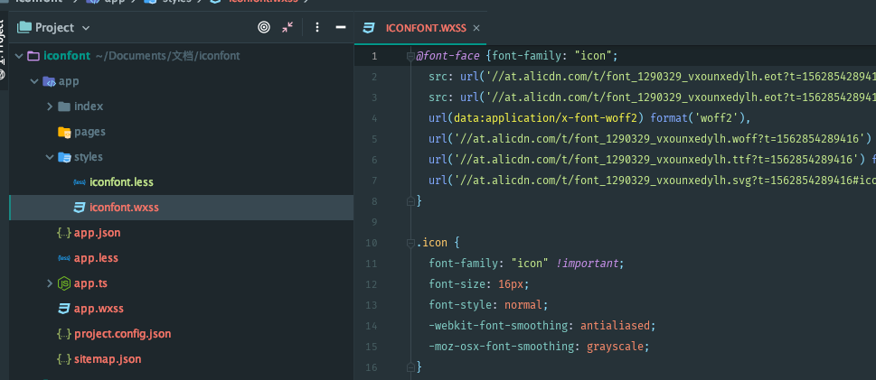

# 微信小程序iconfont（也适用于网页和其他平台的小程序）
在微信小程序等使用iconfont进阶版，17年的时候就发过一次在微信小程序里使用iconfont的文章 [去看看](https://github.com/liziwork/WeChat-for-IconFont) 时隔这么久也掌握了一些这方面的心得，稍微整理了一下。

### 用微信开发工具好还是用成熟的IDE好？
刚开始的时候我也是用开发工具写代码，因为刚接触的时候并没有什么特殊的需求，规规矩矩的按照开发文档来，到后面觉得效率太低了，于是改用了**sublime text** **webstorm**来做小程序开发，开发工具仅仅用来创建项目和预览。久而久之就已经完全弃用开发工具写代码了，并不是说开发工具不行而是说结合起来能给更高效的开发项目。
##### 用webstorm来开发小程序
为什么选择ws而不用vscode，原因就是我用习惯了不想在去更换了。 

----

讲重点：
1. 项目目录结构
2. 安装Less来编写css
3. 利用ws编辑器来自动编译Less生成wxss
4. 快速将iconfont引入项目
5. 简单的一个例子

#### 项目目录结构
```
iconfont
-app                     小程序项目目录
--pages                  页面目录
---index
----index.wxml
----index.less
----index.ts
----index.json
----index.js             (自动编译)
----index.wxss           (自动编译)
--styles                 样式目录
---global.less           全局公共样式
---global.wxss           (自动斌阿姨)
---iconfont.less
---iconfont.wxss         (自动编译)
-app.ts
-app.js                  (自动编译)
-app.less
-app.wxss                (自动编译)
app.json
project.config.json      项目配置文件
sitemap.json             搜索引擎相关配置
-node_modules
```

#### 安装Less
首先确保自己电脑是否安装了node.js，关于怎么安装node.js请自行谷歌或者百度。

全局或者单项目安装less
```shell
npm install -g less
```

#### `webstorm`配置`less`自动编译

##### 打开ws设置找到`File Watchers`

##### 添加一个less类型的监视器

##### 修改默认配置，按下图设置

可以根据自己的习惯来设置，没有规定一定是这样，这套设置是当我less文件有改动我保存时会自动编译输出到wxss文件，这样的好处就是不会有改动就编译，而是保存的时候需要编译了才编译。

#### 新建`iconfont`项目
打开阿里巴巴的图标库[点我](https://www.iconfont.cn) 新建一个项目，然后添加或者上传一些icon图标，生成Font Class的css链接，然后在styles目录下的`iconfont.less`文件里引入刚刚创建的链接，`iconfont.wxss`就会自动生成对应的代码，这样就不用每次icon有改变就得去打开创建的链接然后复制粘贴到iconfont.wxss了。




#### 举个栗子
```less
// index.less文件中引入global.less跟iconfont.wxss
// 至于为什么global引入的是less而iconfont引入的却是wxss
// 因为less是css的预处理语言，所以最终还是会被打包编译成css
// 所以我们global要引入的并不是要打包编译后的css代码
// 而iconfont因为我们在less里面引入了外链后被打包编译了需要的css
@import (reference) "../../styles/global";
@import (css) "../../styles/iconfont.wxss";
```

```html
// 在view里面直接使用icon
<view class="icon iconaixin"></view>
// 循序遍历所有的icon
<view class="container">
    <view wx:for="{{ iconList }}"
          wx:key="item"
          data-index="{{ index }}"
          class="item {{ index === iconIndex ? 'active' : '' }}"
          bind:tap="click">
        <view class="icon icon{{ item.font_class }}"></view>
        <view class="name">{{ item.name }}</view>
    </view>
</view>
```

#### 效果图


大致使用步骤就是，通过ws创建文件的监视器，自动编译打包，大大的提高了开发效率。
我less中使用rpx的时候用的是unit(10, rpx)，当然你也可以直接用10rpx，但是IDE可能会识别不了，编译后或者格式化后会出现10 rpx这种情况，这样开发工具肯定就会报错了，解决办法就是在创建一个监视器，保存打包的时候，把10 rpx替换成10rpx即可，js部分是用ts编写，如果不懂可以直接看编译后的js，差别不会很大！如果也想ts修改代码，请执行`npm install`把相关依赖包下载就行了。


over 如果有疑问或者更好建议欢迎找我交流！

[微信小程序代码片段](https://developers.weixin.qq.com/s/KK1nqNmV7Q95)


[github](https://github.com/liziwork/iconfont)
